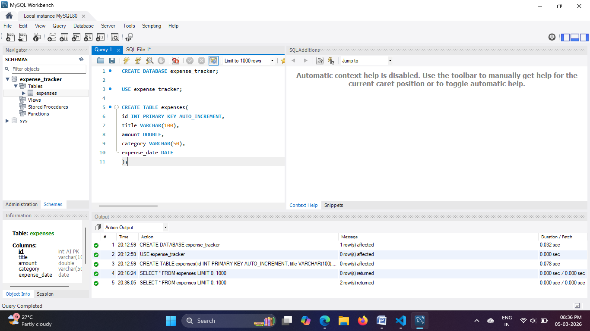
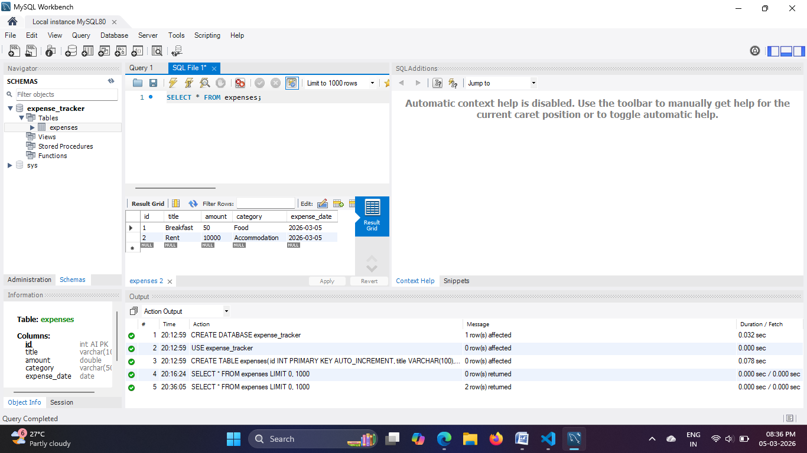

# Expense Tracker (Java)

A console-based Expense Tracker application developed using **Core Java, JDBC, and MySQL**.
This project allows users to manage daily expenses by adding and viewing expense records stored in a MySQL database.

## Features

* Add new expense
* View all stored expenses
* Store expense details in MySQL database
* JDBC connectivity between Java and MySQL
* Simple menu-driven console interface

## Technologies Used

* Java (Core Java)
* MySQL
* JDBC
* Object-Oriented Programming (OOP)

## Database Setup

Run the following SQL commands in MySQL Workbench:

CREATE DATABASE expense_tracker;

USE expense_tracker;

CREATE TABLE expenses(
id INT PRIMARY KEY AUTO_INCREMENT,
title VARCHAR(100),
amount DOUBLE,
category VARCHAR(50),
expense_date DATE
);

The following screenshot shows the creation of the database and table in MySQL Workbench.

## Stored Expense Records

The following screenshot shows the expense records stored in the MySQL database.

## How to Run the Project

1. Clone the repository
2. Open the project in VS Code or any Java IDE
3. Download MySQL Connector/J
4. Compile the program:

javac *.java

5. Run the application:

java Main

## Learning Outcomes

Through this project I learned:

* Java OOP concepts
* JDBC database connectivity
* MySQL database operations
* Building a simple backend console application

## Future Improvements

* Implement update and delete operations for expenses.
* Add monthly and category-wise expense reports.
* Improve the user interface with a graphical interface.
* Convert the application into a web-based system using **Spring Boot**.
* Build REST APIs for managing expenses.
* Develop a frontend interface using **HTML, CSS, and JavaScript** to interact with the backend.
* Deploy the application on a cloud platform for real-time usage.
